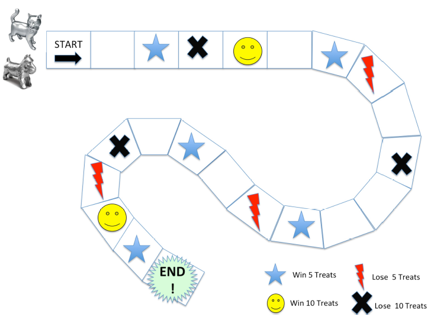

# lab-5

The objective of this assignment is to build an electronic version of a simple board game.
You are going to run a simulation of two players (cat and dog) playing a complete game and determining who the winner is.

The game board:

- Consists of 22 squares
- Each square either:
  - Gives treats to the player
    - Star: Win 5 treats
    - Smiley: Win 10 treats
  - Takes treats away from the player
    - Lightning: Lose 5 treats
    - X: Lose 10 treats
  - Does nothing

Game play:

- All players start on the first square (START)
- A player takes a turn by rolling one die, then moves ahead the number of squares indicated by the die roll.
- If the player lands on a non-blank square, treats are added or taken away from the player. A PLAYER MAY NOT GO NEGATIVE – e.g. if a player owns 5 treats and lands on the "lose 10 treats" square, it brings the players treat count to zero.
- A player continues to roll the die and move on the board until reaching the END square.
- If a player rolls a number greater than the number required to land on the last square, the player must move backward the number of squares indicated by the die. That player will continue to move forward on the next turn. Until the player gets the exact roll required to land on the last square, they may continue to go backward and forward several times.
- After the first player completes the board, the second player goes to completion.
- After both players have landed on the END square, display the total treats owned by each player and display the name of the winner.



Sample Run:

```
GAME BOARD TEST:
0 0 5 -10 10 0 5 -5 0 -10 0 0 5 -5 0 5 0 -10 -5 10 5 0
DIE TEST:
2 5 4 4 6 1 3 3 2 5
CELL NAME TEST:
5 is Star
10 is Smiley
-5 is Lightning
-10 is X
0 is blank
GAME SIMULATION:
CAT'S TURN:
Rolled 1 moved forward...now on square #2 - Now has 0 treats
Rolled 2 moved forward...now on square #4 - Now has 0 treats
Rolled 2 moved forward...now on square #6 - Now has 0 treats
Rolled 6 moved forward...now on square #12 - Now has 0 treats
Rolled 1 moved forward...now on square #13 - Now has 5 treats
Rolled 3 moved forward...now on square #16 - Now has 10 treats
Rolled 4 moved forward...now on square #20 - Now has 20 treats
Rolled 1 moved forward...now on square #21 - Now has 25 treats
Rolled 6 moved backward...now on square #15 - Now has 25 treats
Rolled 3 moved forward...now on square #18 - Now has 15 treats
Rolled 3 moved forward...now on square #21 - Now has 20 treats
Rolled 4 moved backward...now on square #17 - Now has 20 treats
Rolled 2 moved forward...now on square #19 - Now has 15 treats
Rolled 5 moved backward...now on square #14 - Now has 10 treats
Rolled 2 moved forward...now on square #16 - Now has 15 treats
Rolled 6 moved forward...now on square #22 - Now has 15 treats
REACHED THE END!
Cat finished with 15 treats!

DOG'S TURN:
Rolled 2 moved forward...now on square #3 - Now has 5 treats
Rolled 3 moved forward...now on square #6 - Now has 5 treats
Rolled 5 moved forward...now on square #11 - Now has 5 treats
Rolled 4 moved forward...now on square #15 - Now has 5 treats
Rolled 6 moved forward...now on square #21 - Now has 10 treats
Rolled 5 moved backward...now on square #16 - Now has 15 treats
Rolled 5 moved forward...now on square #21 - Now has 20 treats
Rolled 2 moved backward...now on square #19 - Now has 15 treats
Rolled 1 moved forward...now on square #20 - Now has 25 treats
Rolled 3 moved backward...now on square #17 - Now has 25 treats
Rolled 5 moved forward...now on square #22 - Now has 25 treats
REACHED THE END!
Dog finished with 25 treats!

Dog won!
```

## Compile and Run

    javac BoardGame.java
    java BoardGame
