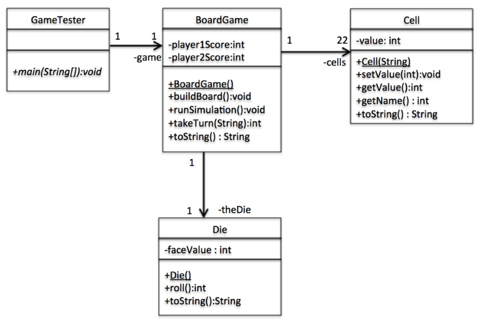
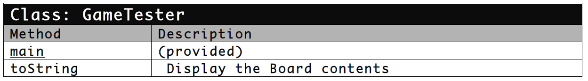
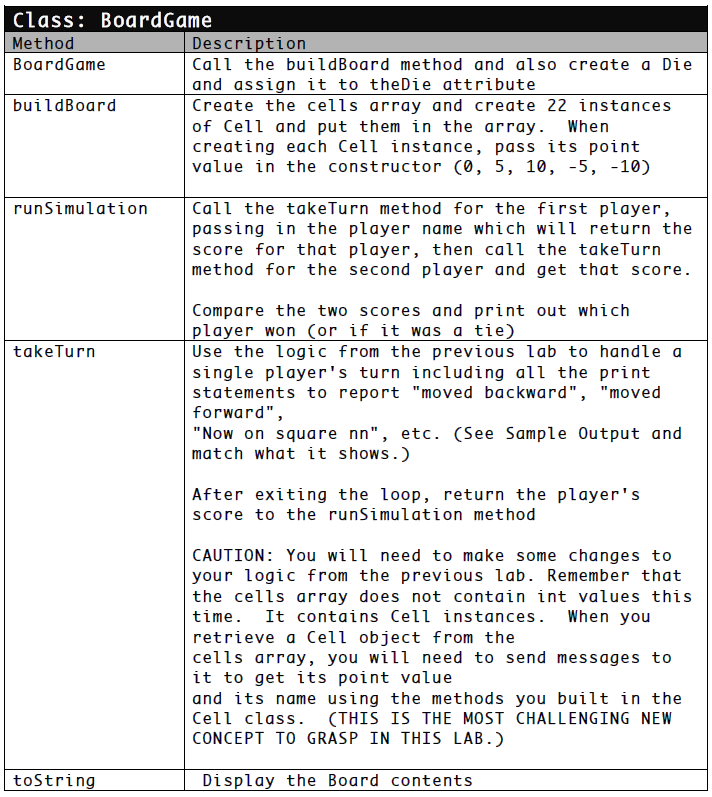
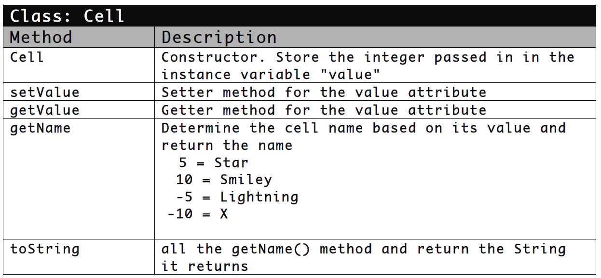
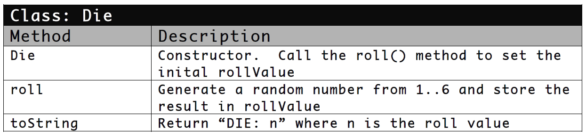

# lab-6

The objective of this assignment is to rewrite your previous lab solution (the Board Game) as an object oriented program.
Although you will need to write some new code, you should be able to reuse much of the code you developed in Lab 5.
You just need to determine where to put it, and how to change it to function as an OO system.
The game layout and rules are the same as Lab 5, so you can refer to those instructions if needed.











Sample Run:

```
BOARD: blank blank Star X Smiley blank Star Lightning blank X blank blank Star Lightning blank Star blank X Lightning Smiley Star blank
STARTING GAME:
dog's Turn:
Rolled 2 moved forward....now on Star (#3) - Now has 5 treats
Rolled 1 moved forward....now on X (#4) - Now has 0 treats
Rolled 3 moved forward....now on Star (#7) - Now has 5 treats
Rolled 2 moved forward....now on blank (#9) - Now has 5 treats
Rolled 1 moved forward....now on X (#10) - Now has 0 treats
Rolled 5 moved forward....now on blank (#15) - Now has 0 treats
Rolled 3 moved forward....now on X (#18) - Now has 0 treats
Rolled 5 moved backward...now on Star (#13) - Now has 5 treats
Rolled 3 moved forward....now on Star (#16) - Now has 10 treats
Rolled 6 moved forward....now on blank (#22) - Now has 10 treats
REACHED THE END!
cat's Turn:
Rolled 1 moved forward....now on blank (#2) - Now has 0 treats
Rolled 3 moved forward....now on Smiley (#5) - Now has 10 treats
Rolled 5 moved forward....now on X (#10) - Now has 0 treats
Rolled 3 moved forward....now on Star (#13) - Now has 5 treats
Rolled 3 moved forward....now on Star (#16) - Now has 10 treats
Rolled 5 moved forward....now on Star (#21) - Now has 15 treats
Rolled 2 moved backward...now on Lightning (#19) - Now has 10 treats
Rolled 4 moved backward...now on blank (#15) - Now has 10 treats
Rolled 4 moved forward....now on Lightning (#19) - Now has 5 treats
Rolled 4 moved backward...now on blank (#15) - Now has 5 treats
Rolled 3 moved forward....now on X (#18) - Now has 0 treats
Rolled 2 moved forward....now on Smiley (#20) - Now has 10 treats
Rolled 3 moved backward...now on blank (#17) - Now has 10 treats
Rolled 3 moved forward....now on Smiley (#20) - Now has 20 treats
Rolled 5 moved backward...now on blank (#15) - Now has 20 treats
Rolled 4 moved forward....now on Lightning (#19) - Now has 15 treats
Rolled 1 moved forward....now on Smiley (#20) - Now has 25 treats
Rolled 1 moved forward....now on Star (#21) - Now has 30 treats
Rolled 4 moved backward...now on blank (#17) - Now has 30 treats
Rolled 5 moved forward....now on blank (#22) - Now has 30 treats
REACHED THE END!
cat (30) beat dog (10)
```

---

## Compile and Run

    javac GameTester.java
    java GameTester
