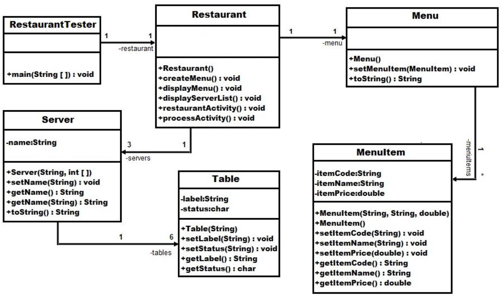
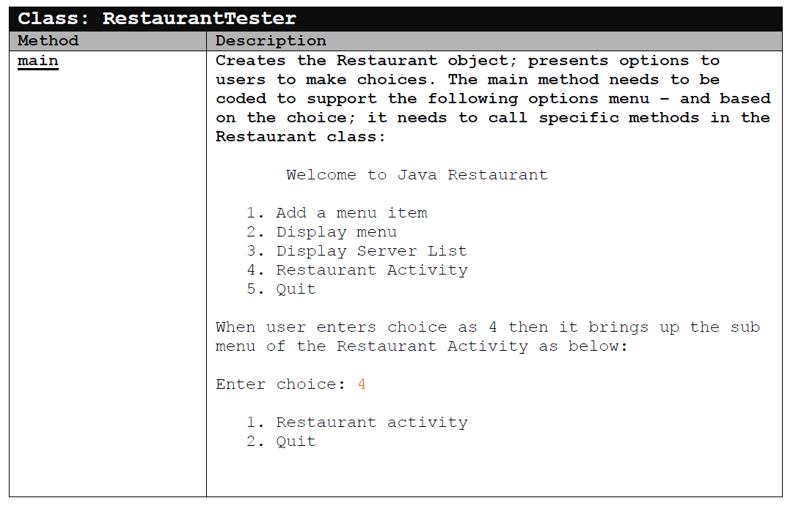
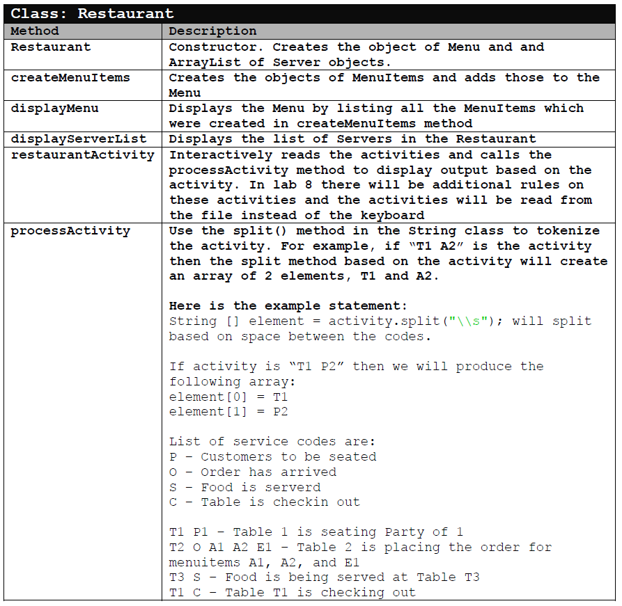
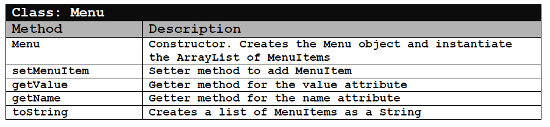
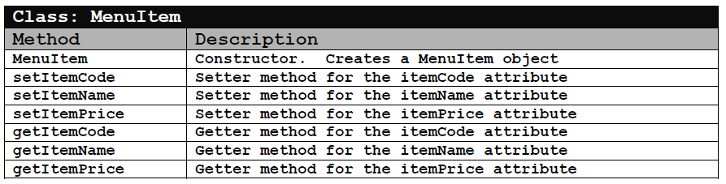
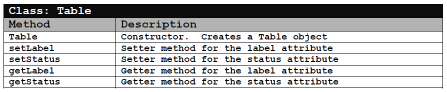
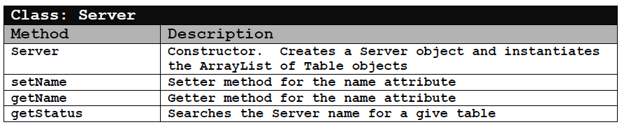

# lab-7

The objective of this assignment is to get further experience in designing a solution with multiple classes and class composition.
In this lab we will introduce the Java ArrayList which is a very powerful data structure and it does many of the functionalities of handling arrays which we have been coding ourselves. It is part of the java.util package and will be imported as below:

    Import java.util.ArrayList;

Java ArrayList does not require the size of the array to be known in advance; and handles both primitive and user defined objects as its elements.

A few examples statments:

```java
ArrayList<String> myStringList = new ArrayList<String>();
myStringList.add(“Java”);
myStringList.add(“Programming”);
myStringList.add(“is fun!”);
for (int i=0; i<myStringList.size( ); ++i)
    System.out.println(myStringList.get(i));
```















---

## Compile and Run

    javac RestaurantTester.java
    java RestaurantTester
