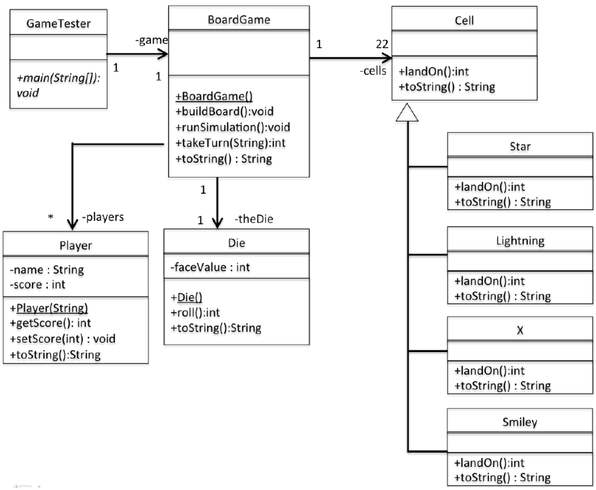

# lab-8

The objective of this assignment is to rewrite your lab 6 solution (the OO Board Game) to support inheritance and File I/O.
Although you will need to write some new code, you should be able to reuse much of the code you developed in Lab 6.
You just need to determine where to put it, and how to change it to function as instructed.
The game layout and rules are the same as Lab 6, so you can refer to those instructions if needed.

Changes to previous solution:

1. Remove the value attribute and related methods from class `Cell`.
2. Create a `landOn` method in cell which returns the score amount to be added to the player’s score when landed on.
   The Cell class should return a score of zero. (It represents a blank cell.)
3. The `toString` method in `Cell` should return "Blank".
4. Create four subclasses of the class `Cell`.
   Each should override the `landOn` method to return the score of that cell subtype.
   Also, override the `toString` method in each subclass to return the name of the type of cell it is:
   - Star
   - Smiley
   - Lightning
   - X
5. Change the `buildBoard` method in the class BoardGame.
   It should create instances of the correct type of `Cell` for each location on the board.
   Use the superclass `Cell` for blank cells, and use the appropriate subclass for the other four types of cell.
   Change the collection of Cells to be an ArrayList instead of an array.
6. Create a new class called `Player` that maintains the name and score of each player.
7. Remove the player score attributes from `BoardGame` and instead, create an ArrayList of Player objects.
8. In the constructor for `BoardGame`, create Player objects by reading in a list of player names from an external file called `players.txt`.
   Create a separate Player object for each player name found in the file. (each player name will be on a separate line.)
9. Change the simulation code to handle multiple Player objects from the players ArrayList.
10. After running the simulation, write out a new text file called `results.txt`. It should contain each player’s name with their score.
11. Change the takeTurn method in `BoardGame` to a return type of void.
    Instead of returning the score, set each player’s score attribute to the score value received at the end of playing.
12. You’ll need to change the logic in your `runSimulation` method in `BoardGame` to account for an unknown number of players.
    You will want to use a loop and send the `takeTurn` message to each Player in your players ArrayList.
13. Make sure you change all the array code from your previous solution with the appropriate ArrayList methods.

---

## Compile and Run

    javac GameTester.java
    java GameTester
