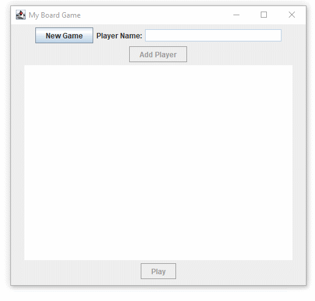

# lab-9

The objective of this lab is to expand on the previous work (Lab #8) by adding a Graphical User Interface.
You will get the opportunity to work with interfaces, listeners, Inner classes, and components which are modified during run time.

Build the frame with the components, listeners and inner classes needed for the GUI. Name this new frame class: `BoardGameWindow`.

Modify the classes from the Lab 8 version of your board game and comment out (or remove) all the File I/O code.
You will be using the GUI you build to manage all input and output instead of external files.

Connect the `BoardGameWindow` class to your `BoardGame` class. Add any methods that are needed to `BoardGame` and the other classes to provide the text needed to display the information you need on your GUI.

Your GUI should look as close to this as possible:

Note:

- When starting the program, the "New Game" button is the only one that is enabled.
  The other fields should be disabled so they can't be used.
  Use the `setEnabled` method that is inherited by each Swing component. (e.g. `myButton.setEnabled(true)` or `myButton.setEnabled(false)`).

- It's suggested that you use the following widgets: JButton, JLabel, JTextField, JTextArea.
  You should look at the API documentation to determine which methods you can use with each of these to change or clear their contents/labels/etc.
  You may have to try different sizes with the JTextArea to get the widgets to wrap/display properly.
  You can set the JTextArea size in its constructor.

- After the New Game button is pressed, it should be disabled, and the other widgets should be enabled.
  When "New Game" is pressed, and instance of `BoardGame` should be created.
  Write the text "NEW GAME!" in the JTextPane at this time.

- Change the constructor of your `BoardGame` class to remove all logic that creates `Player` instances using data from the external text file.
  Instead, add an `addPlayer(String)` method to BoardGame which creates a player using the String passed in as its name.
  Add this new Player instance to the BoardGame's players collection.

- When you enter a name in the Player Name field, then press the “Add Player” button,
  send the addPlayer message to your game and append the contents of the JTextArea with the new Player's name.
  Continue adding play ers as you wish, then press the Play button.

- When the Play button is pressed, send the runSimulation message to your BoardGame.
  Remove all the `System.out.println` statements from your runSimulation method.
  Instead, create a String containing the results of playing the game (this is the text you wrote to the output file in Lab #8), return that
  String to your `BoardGameWindow` and display the contents in the JTextArea (as shown to the left).
  You can keep all the println statements in the `takeTurn` method that print the details of each player's turn to the console window.

- Also, after Play is pressed, disable the Player Name field, the Add Player button, and the Play button, and enable the New Game button.
  When "New Game" is pressed, a new game instance is created and the sequence starts over.

- Note that all the details within each player’s turn will display on your console window as they did before.
  Also note that the console cursor/prompt will be “stuck” as long as the BoardGameWindow is still open and running.
  You will get control of your cursor back when you close the BoardGameWindow.

---

## Compile and Run

    javac GameTester.java
    java GameTester
